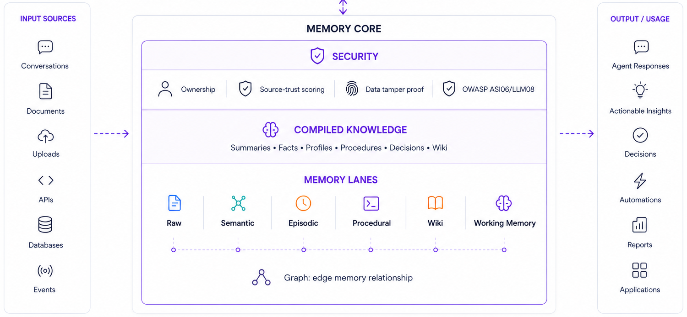

```
                                 _   _ __  __   _  
                                | | | |  \/  | /_\ 
                                | |_| | |\/| |/ _ \
                                 \___/|_|  |___/ \_\
```
**Universal Memory Architecture** — long-lived, evidence-backed memory for AI agents, with security built into every write and every read.

UMA is a memory and context runtime SDK for developers building AI agents. It ingests data, stores it across six typed memory lanes, and exposes a small retrieval surface. **UMA manages memory only** — your application owns prompts, tool use, reasoning, and final responses.

UMA does not generate assistant replies and does not perform agent reasoning.
Developers bring their own LLM or agent loop and use UMA strictly for memory
management.

> **Status:** beta.

🌐 Website: [uma.ai-mem-engineering.com](https://uma.ai-mem-engineering.com) · 📄 Documentation: [uma.ai-mem-engineering.com/docs.html](https://uma.ai-mem-engineering.com/docs.html)

---

## ✨ Why UMA

- 🧠 **Six typed memory lanes** — working memory, semantic facts, raw chunks, episodic, procedural, compiled wiki. You choose what to query.
- 🪶 **One install, zero external services** — embedded SQLite + LanceDB. `pip install -e .` and you're running.
- 🛡️ **Security by design** — every artifact is owner-scoped, injection-scanned, trust-scored, and content-hashed before it touches storage.
- 🔍 **Evidence-backed retrieval** — every fact carries provenance back to source chunks. No silent degradation into "vibes-based" RAG.
- 🏢 **Multi-tenant by construction** — cross-tenant access is impossible at the storage layer, not by application-layer convention.

---

## 🏛️ Architecture


=======


UMA is a thin SDK around three concerns: **ingest** (data flows in, gets scanned, chunked, embedded), **storage** (SQLite is authoritative, LanceDB is a rebuildable accelerator), and **retrieval** (a canonical pipeline through candidate discovery, fusion, trust-aware ranking, and snippet rendering). Every write boundary scans for prompt injection; every read boundary enforces tenant/owner isolation and filters quarantined records.

For the full architectural model — invariants, pipelines, the vector isolation contract, and the OWASP Top 10 mapping — see [`ARCHITECTURE.md`](ARCHITECTURE.md).

---

## 🛡️ Security by Design

Security in UMA isn't a feature — it's the shape of every code path. Five primitives compose:

1. **Two-layer injection scanning** — pre-LLM advisory gate + write-time defense-in-depth
2. **Trust scoring + quarantine** — every artifact carries a trust score and quarantine flag; retrieval excludes quarantined records by construction
3. **Content hashing + integrity verification** — SHA-256 on every typed artifact; on-demand verification quarantines tampered records
4. **Ingest gating** — MIME consistency, file size caps, HTML/Markdown sanitization
5. **Retrieval audit log** — every retrieve call is recorded with a hashed query preview

### Defense-in-Depth Against Memory Poisoning (ASI06)

Memory poisoning is a stateful attack — a single injection can permanently corrupt an agent's knowledge base across all future sessions. Single-layer defenses are rarely enough. UMA implements the [four-layer defense-in-depth model](https://vectorize.io/articles/how-to-prevent-ai-memory-poisoning) recommended for production agent memory:

| Layer | What it means | UMA's implementation |
| --- | --- | --- |
| **1. Pre-Write Sanitization** | Block malicious content before it enters memory stores | Two-layer injection scanning: advisory pre-LLM gate (`scan_user_input`) + write-time boundary scan (`scan_artifact_text`) at every storage boundary. 15-rule YAML catalog aligned with [OWASP Agent Memory Guard](https://owasp.org/www-project-agent-memory-guard/). High severity → quarantine + trust=0.0; medium/low → trust reduction. |
| **2. Provenance Tracking** | Tag and trace the origin of every stored artifact | Every Fact, Episode, Skill, and Chunk carries `source_chunk_ids`, `content_hash`, `trust_score`, and a `meta.security.audit_log`. `verify_integrity` re-derives SHA-256 hashes and quarantines on mismatch. `lint_memory_drift` detects compiled artifacts whose raw evidence has drifted. Source trust is classifier-derived: user turn (0.9) > document (0.7) > assistant reply (0.7) > tool output (0.5). |
| **3. Temporal Decay** | Reduce influence of older memories so corrupted data doesn't anchor permanently | **Not implemented in UMA.** Trust scores are set at write time and do not decay automatically. Time-weighted ranking or TTL policies are caller responsibility. |
| **4. Memory Isolation** | Strict per-user isolation so one poisoned interaction can't infect others | `tenant_id` / `owner_type` / `owner_id` enforced at every SQL read and at the vector layer (LanceDB pushes isolation into the `WHERE` clause before the k-nearest cap — cross-tenant leakage is impossible by construction, not by application convention). |

### Mapping to OWASP Top 10 for LLM Applications 2025

The [OWASP Top 10 for LLM Applications 2025](https://genai.owasp.org/llm-top-10/) is the de-facto reference for AI application security. UMA is a memory SDK — not every category applies. Here's the honest mapping:

| OWASP 2025 Category | Scope | UMA's contribution |
| --- | --- | --- |
| 🟢 **LLM01: Prompt Injection** | In scope | Two-layer scanning: advisory pre-LLM gate (`scan_user_input`) + write-time per-artifact scan. High severity → quarantine; medium/low → trust reduction. |
| 🟢 **LLM02: Sensitive Information Disclosure** | Partial — memory-layer | Audit log stores SHA-256-hashed query previews only. Ownership isolation prevents cross-user data exposure at the storage layer. HTML sanitization strips active content at ingest. Output redaction is caller responsibility. |
| 🟢 **LLM04: Data and Model Poisoning** | In scope (RAG path) | MIME gate + HTML sanitization block malicious ingest. Quarantined chunks are dropped before fact extraction. SHA-256 `content_hash` + `verify_integrity` detect post-hoc tampering. |
| 🟢 **LLM08: Vector and Embedding Weaknesses** | In scope — primary | LanceDB promotes `tenant_id` / `owner_type` / `owner_id` to indexed columns and pushes them into `WHERE` before the k-nearest cap. Cross-tenant access impossible by construction. |
| 🟢 **LLM09: Misinformation** | Partial | Every fact carries `source_chunk_ids` for provenance back to raw evidence. `LatestWinsFactResolver` excludes quarantined facts from canonical selection. `lint_memory_drift` detects stale provenance. |
| 🟢 **LLM10: Unbounded Consumption** | In scope | `set_rate_limit_hook` on every public method. `max_file_bytes`, `pdf_max_pages`, and RLM hard budgets (`max_steps`, `max_env_calls`, `timeout_s`) cap resource use. |
| 🟢 **ASI03: Identity & Privilege Abuse** (Agentic AI) | Partial — memory-layer | Explicit `tenant_id` / `owner_type` / `owner_id` on every artifact, enforced at the storage layer. Promotion requires explicit scope escalation. Agent identity itself is the caller's concern. |
| 🟢 **ASI05: Unexpected Code Execution** (Agentic AI) | Partial — ingest-only | MIME consistency check rejects executables; HTML/Markdown sanitized before storage. UMA itself executes no code from memory. |
| 🟢 **ASI06: Memory Poisoning** (Agentic AI) | **Primary focus — full** | Defense-in-depth across all four recommended layers (see table above). Write-time scan + quarantine at every storage boundary. Quarantined artifacts never enter retrieval and never seed fact extraction. SHA-256 integrity verification detects post-write tampering. |

**Six of ten LLM categories apply.** UMA is honest about what it covers and what's out of scope — there's no security theater. The four out-of-scope categories belong to the calling application: output handling, agent design, system prompts, and supply-chain procurement of models. Pair UMA with the controls appropriate to those layers for full coverage.

**Three of ten ASI categories apply.** UMA is a memory SDK, not an agent. The remaining seven belong to the agent layer above UMA — they require tool use, autonomy, or inter-agent communication that UMA doesn't have.

For the full security model — including the injection pattern catalog, severity behavior, quarantine lifecycle, and integrity verification — see [`.claude/skills/uma-security.md`](.claude/skills/uma-security.md) for the deep dive, or [`ARCHITECTURE.md`](ARCHITECTURE.md) for the architectural model.

---

## Quickstart

```bash
pip install -e .
```

```python
from uma import UMAMemory

memory = UMAMemory.from_yaml("config/uma.yaml").set_context(agent_id="my-agent")

context = await memory.retrieve_context(
    query_text=user_message,
    user_id="user-123",
    tenant_id="default",
    session_id="session-1",
)

reply = await your_llm(context, user_message)   # you own this

await memory.process_turn(
    user_id="user-123",
    user_msg=user_message,
    assistant_reply=reply,
    session_id="session-1",
    tenant_id="default",
)
```

That's the whole loop. For the full agent integration pattern — pre-LLM injection scanning, error handling, multi-tenant SaaS, rate limiting — **ask your coding assistant** (see below).

If a storage adapter needs credentials, `uma.yaml` also accepts an optional `secrets:` block; the reference shape lives in [`.claude/skills/uma-configure.md`](.claude/skills/uma-configure.md).

## Maintenance Primitives

Lite keeps maintenance writes inside the same canonical storage boundaries as normal ingest:

- Re-ingesting the same tenant/owner/source path with changed content creates a new manifest version and links it to the immediately prior manifest via `supersedes` / `superseded_by`.
- Semantic facts can have `trust_score` adjusted after write through `memory.semantic_core.update_trust(...)`, which preserves an in-record audit trail under `meta["trust_updates"]`.

---

## 🤖 Living Docs for AI Assistants

**You shouldn't have to read tons of documentation to use UMA.** Ask your coding agent instead.

UMA ships eight Agent Skills under `.claude/skills/`. They're structured markdown files with YAML frontmatter that Claude Code (and any [Agent Skills](https://docs.claude.com/en/agents-and-tools/agent-skills/overview)-compatible assistant) automatically loads as context when you ask questions about the project. No setup. No `@` mentions. Just ask:

> *"How do I integrate UMA into my chatbot?"*
> → `uma-agent-loop.md` loads — end-to-end pattern with code

> *"What happens when a user sends a prompt injection?"*
> → `uma-security.md` + `uma-quarantine.md` load — full flow from scan to storage

> *"How do I write a custom vector backend?"*
> → `uma-vector-contract.md` loads — the contract, atomicity, score normalization

> *"How do I filter by lane?"*
> → `uma-lanes.md` loads — the six lanes, when to use each

> *"My YAML — can you help me configure Anthropic as the LLM?"*
> → `uma-configure.md` loads — full YAML reference

### The eight skills

| Skill | Covers |
| --- | --- |
| [`uma-overview.md`](.claude/skills/uma-overview.md) | What UMA is, design philosophy, DAT invariants, security primitives at a glance |
| [`uma-api.md`](.claude/skills/uma-api.md) | Full public API — every method, every management function, scope fields |
| [`uma-lanes.md`](.claude/skills/uma-lanes.md) | Six memory lanes, storage contracts, quarantine semantics, retrieval pipeline |
| [`uma-configure.md`](.claude/skills/uma-configure.md) | YAML reference, LLM/embedding providers, security configuration, install surfaces |
| [`uma-security.md`](.claude/skills/uma-security.md) | Two-layer scanning, pattern catalog, severity behavior, integrity verification |
| [`uma-agent-loop.md`](.claude/skills/uma-agent-loop.md) | End-to-end integration: scan → retrieve → LLM → process_turn |
| [`uma-vector-contract.md`](.claude/skills/uma-vector-contract.md) | Vector isolation contract, push-down filters, custom backend authoring |
| [`uma-quarantine.md`](.claude/skills/uma-quarantine.md) | Quarantine lifecycle, management API, composition with trust scoring |

Each skill is under 500 lines, follows the Agent Skills specification (third-person `description` field for discovery), and is verified against the patched codebase — no phantom APIs.

Assistants that don't follow `.claude/skills/` can read the same files directly, or via a symlink at `.agents/skills/` if your tooling uses that path.

---

## License & Status

UMA is Apache-2.0 licensed and currently in beta. Production packaging is not included in this public repo; a future private or commercial package may provide production-specific profiles, managed-service adapters, and deployment tooling.

For the architectural deep dive, see [`ARCHITECTURE.md`](ARCHITECTURE.md). For everything else, ask your assistant.
